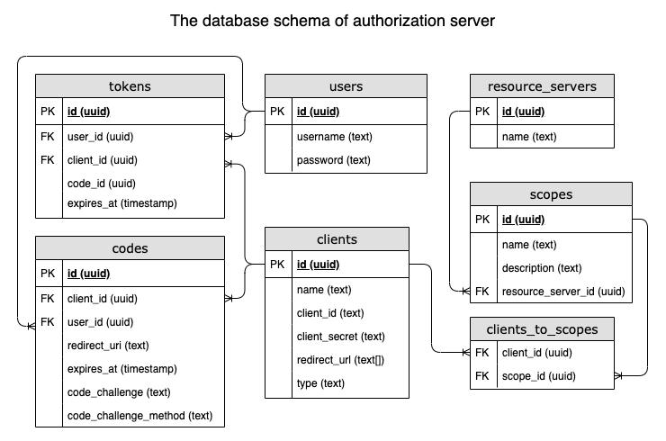
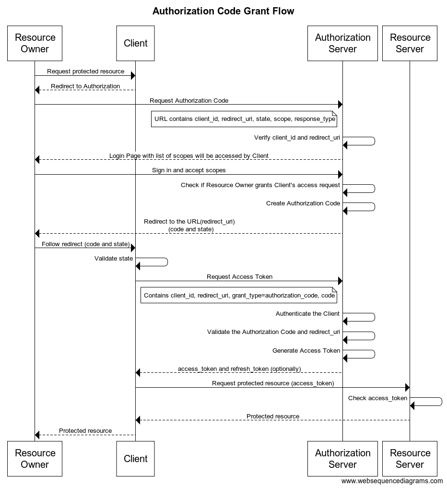

# Auther

Authorization server with OAuth support and recommended usage patterns

## Development

-  Create `.env` file using example `.env.example`
-  Create public/private keypair file and move it to `src/data`
```
$ npx babel-node scripts/cli secrets keypair keypair.json
```
- Run docker compose 
```
$ docker-compose -f docker-compose.yml -f docker-compose.dev.yml up --build
```

## Production (not tested)

```
$ docker-compose -f docker-compose.yml -f docker-compose.prod.yml up -d --build
```

## DB structure



## Supported grants

### Authorization Code Grant Flow with PKCE


